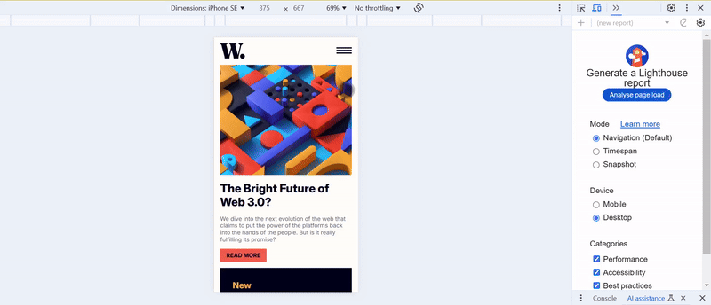

# Frontend Mentor - News homepage solution

This is a solution to the [News homepage challenge on Frontend Mentor](https://www.frontendmentor.io/challenges/news-homepage-H6SWTa1MFl). Frontend Mentor challenges help you improve your coding skills by building realistic projects.

## Table of contents

- [Overview](#overview)
  - [The challenge](#the-challenge)
  - [Screenshot](#screenshot)
  - [Links](#links)
- [My process](#my-process)
  - [Built with](#built-with)
  - [What I learned](#what-i-learned)
  - [Continued development](#continued-development)
  - [Useful resources](#useful-resources)
- [Author](#author)

## Overview

### The challenge

Users should be able to:

- View the optimal layout for the interface depending on their device's screen size
- See hover and focus states for all interactive elements on the page

### Screenshot



### Links

- Solution URL: [Github](https://github.com/snigdha-sukun/news-homepage)
- Live Site URL: [Vercel](https://news-homepage-six-tau.vercel.app/)

## My process

### Built with

- Semantic HTML5 markup
- CSS custom properties
- Flexbox
- CSS Grid

### What I learned

I leared how to add image as background inside grid layout as well as mobile view:

```html
<header class="banner"></header>
```

```css
.banner {
    grid-column: 1 / 3;
    grid-row: 1 / 2;
    background-image: url("./assets/images/image-web-3-desktop.jpg");
    background-size: cover;
    background-repeat: no-repeat;
}

@media (max-width: 768px) {
  .banner {
    background-image: url("./assets/images/image-web-3-mobile.jpg");
    height: 18rem;
  }
}
```

I learned how to create sliding navbar:

```html
<div class="mobile_menu" id="menu_hamburger" aria-label="Menu">
  
</div>
<nav id="nav_menu">
  <div class="close_menu" id="close_menu" aria-label="Close Menu">
    
  </div>
  <ul>
    <li>Home</li>
    <li>New</li>
    <li>Popular</li>
    <li>Trending</li>
    <li>Categories</li>
  </ul>
</nav>
```

```css
nav {
  height: 100%;
  width: 0;
  position: fixed;
  z-index: 1;
  top: 0;
  right: 0;
  background-color: var(--off-white);
  color: var(--very-dark-blue);
  overflow-x: hidden;
  transition: 0.5s;
  padding-top: 5rem;
}

ul {
  flex-direction: column;
}

.close_menu {
  display: block;
  position: absolute;
  top: 0;
  right: 1rem;
}
```

```js
const menuHamburger = document.getElementById('menu_hamburger');
const closeMenu = document.getElementById('close_menu');
const nav_menu = document.getElementById('nav_menu');
const body = document.querySelector('body');

menuHamburger.addEventListener("click", () => {
    nav_menu.style.width = "250px";
    document.body.style.backgroundColor = "hsla(240 100% 5% / 0.4)";
});

closeMenu.addEventListener("click", () => {
    nav_menu.style.width = "0";
    document.body.style.backgroundColor = "hsl(36, 100%, 99%)";
});
```

I also learned how to debug a div if its not showing up:

```css
border: 2px solid red;
```

### Continued development

I still need to practice the positioning an element & `@media`. I need to practice using JS for making the UI to react to different events. I also need to learn about responsive CSS, HTML5 rules & JS best practices. I need to learn more about `aria-*` tags for accessibilty.

### Useful resources

- [HTML Landmark Roles](https://developer.mozilla.org/en-US/blog/aria-accessibility-html-landmark-roles/) - This helped me learn about using HTML landmark roles to improve accessibility
- [SideNav](https://www.w3schools.com/howto/howto_js_sidenav.asp) - This helped me in adding sidenav in my solution

## Author

- Frontend Mentor - [@snigdha-sukun](https://www.frontendmentor.io/profile/snigdha-sukun)
